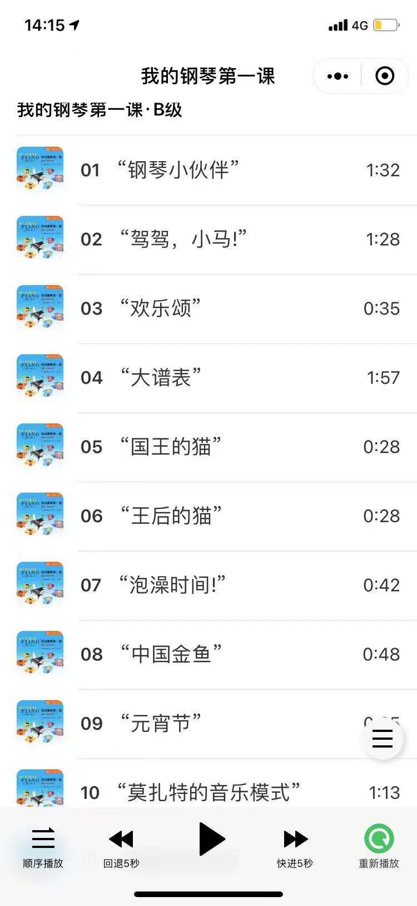

# 我的钢琴第一课音频播放器
> 利用微信小程序背景音频api BackgroundAudioManager, 可实现在后台播放音频

## Demo

## 起因
女儿的钢琴课程会有好多音频素材, 平时练习的时候需要经常播放. 初期的素材都是老师发在微信上的, 素材多了找起来就不方便了. 因此做了一个小程序, 把素材都集中起来. 小程序中的素材都是取自教材官网.

## 小程序中的图标
图标来自https://remixicon.com/, 由于小程序中不支持svg, 可以使用fontface.

## 播放器
这个版本实现了播放器的基本功能, 包括快/慢速播放, 播放模式切换等. 仅供参考.

